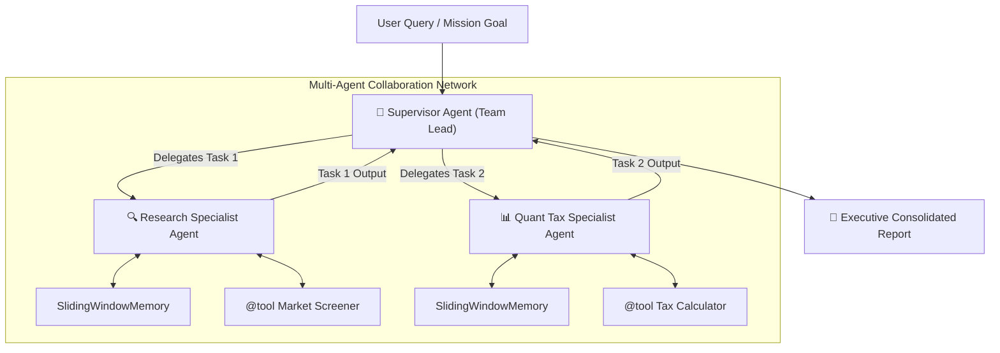

# 🤖 Modular Multi-Agent AI Framework

A lightweight, production-grade, zero-dependency **Multi-Agent Orchestration & Reasoning Framework** built completely from scratch in Python using pure Object-Oriented Programming (OOP) and Design Patterns.

Inspired by the internals of LangChain, CrewAI, and LangGraph, this framework demonstrates how autonomous AI systems think, execute tools, manage memory buffers, track API telemetry, and collaborate in teams.

---

## 🏗️ Architecture Overview



---

## 🎯 Key Features & OOP Design Patterns

| Component | Design Pattern / OOP Concept | Purpose |
| :--- | :--- | :--- |
| **`core/base_tool.py`** | **Abstract Base Class (`ABC`)** + Custom Decorator (`@tool`) | Standardizes tool execution contracts and auto-extracts docstrings & schemas. |
| **`core/base_memory.py`** | **Sequence Protocol (`__len__`, `__getitem__`)** + Strategy Pattern | Prevents token overflow via `SlidingWindowMemory` and enables TF-IDF semantic retrieval via `SemanticMemory`. |
| **`core/base_llm.py`** | **Factory Pattern** + **Context Manager (`__enter__`, `__exit__`)** | Dynamic LLM swapping (`MockLLM`, `Gemini`, `OpenAI`) and live token cost tracking in INR (₹). |
| **`agents/react_agent.py`** | **ReAct Loop & State Encapsulation** | Implements the **Thought $\rightarrow$ Action $\rightarrow$ Observation** autonomous loop with loop circuit breakers (`max_iterations`). |
| **`agents/supervisor_agent.py`** | **Supervisor / Team Orchestration Pattern** | Decomposes complex user missions into sub-tasks and coordinates specialist agents to synthesize final reports. |

---

## 🚀 Quick Start

### 1. Run the Framework Demo
```bash
python main.py
```

### 2. Run the Unit Test Suite
```bash
python tests/test_tools.py
python tests/test_memory.py
python tests/test_llm.py
python tests/test_agent.py
```

---

## 💻 Sample Output

```text
==================================================
🚀 MODULAR MULTI-AGENT AI FRAMEWORK INITIALIZING
==================================================

--- 🟢 [Telemetry Active] Token & Cost Tracking Started ---

👔 [ChiefInvestmentOfficer - Team Lead] Starting Multi-Agent Pipeline:
Team Roster:
- AutoSectorSpecialist: Equity Research Analyst
- QuantTaxSpecialist: Portfolio Tax Strategist

👉 Step 1: Delegating to [AutoSectorSpecialist]...
🤖 [AutoSectorSpecialist] Started processing: 'Screen the auto sector for top picks.'
  🔄 Loop Step 1/6
  🛠️ [AutoSectorSpecialist] Executing Tool: indian_market_screener(auto)
  👁️ [AutoSectorSpecialist] Observation: Top Pick: TATA MOTORS (CMP: ₹980, YoY EV Growth: +42%)
  🔄 Loop Step 2/6
  ✨ [AutoSectorSpecialist] Reached Final Answer!

👉 Step 2: Delegating to [QuantTaxSpecialist]...
🤖 [QuantTaxSpecialist] Started processing: 'Calculate tax on ₹80,000 profit held for 18 months.'
  🔄 Loop Step 1/6
  🛠️ [QuantTaxSpecialist] Executing Tool: calculate_capital_gains_tax(80000, 18)
  👁️ [QuantTaxSpecialist] Observation: LTCG (12.5%): ₹10,000.00 on profit of ₹80,000.00
  🔄 Loop Step 2/6
  ✨ [QuantTaxSpecialist] Reached Final Answer!

--- 🔴 [Telemetry Report] Total Tokens: 94 | Estimated Cost: ₹0.0235 ---

==================================================
📑 EXECUTIVE MULTI-AGENT REPORT
🎯 Objective: Investigate Indian Auto sector leader and compute LTCG tax on ₹80,000 anticipated profit.
==================================================

🔹 Contribution from [AutoSectorSpecialist]:
Tata Motors is the top pick in Auto sector (CMP: ₹980) driven by 42% EV growth.

🔹 Contribution from [QuantTaxSpecialist]:
For an 18-month holding of ₹80,000 profit, LTCG tax at 12.5% comes to ₹10,000.00.

==================================================
✅ Status: Completed & Verified by Supervisor
==================================================
```

---

## 👨‍💻 Author
Built by **Kunal** as part of the **Road to Gen AI & Advanced OOP** Series.
