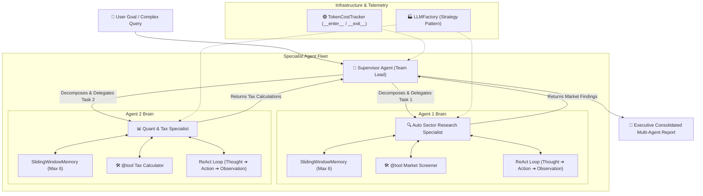

# 🤖 Modular Multi-Agent AI Framework

[](https://python.org)
[](#-oop-design-patterns-deep-dive)
[](#)
[](LICENSE)

> **A production-grade, zero-dependency Multi-Agent AI Orchestration Engine engineered from scratch in pure Python using Object-Oriented Programming (OOP) and Software Design Patterns.**

Inspired by the internal architectures of **LangChain, CrewAI, and LangGraph**, this framework strips away third-party black-box bloat to expose the exact mechanics of how autonomous AI agents think (ReAct loop), execute tools dynamically, manage short/long-term memory buffers, track API token costs via telemetry context managers, and collaborate in specialist teams.

---

## 📑 Table of Contents
- [Why Build This?](#-why-build-this)
- [System Architecture](#-system-architecture)
- [Repository Structure](#-repository-structure)
- [OOP & Design Patterns Deep-Dive](#-oop--design-patterns-deep-dive)
- [Quick Start Guide](#-quick-start-guide)
- [Running Unit Tests](#-running-unit-tests)
- [Live Execution Output](#-live-execution-output)
- [🎬 YouTube Video Creation Guide & Script](#-youtube-video-creation-guide--script)
- [Author & Connect](#-author--connect)

---

## 💡 Why Build This?

Most AI engineers rely on high-level libraries like `langchain` or `crewai` without understanding their internal mechanisms. In technical interviews at top AI companies, candidates are asked:
* *How do tool schema reflection and runtime argument validation work under the hood?*
* *How do you prevent cyclic runaway loops in multi-agent handoffs?*
* *How do memory buffers implement Python sequence protocols to prevent context window overflow?*

This repository is a fully transparent, modular reference implementation that answers all of those questions with clean, production-ready code.

---

## 🏗️ System Architecture



---

## 📂 Repository Structure

```text
Modular-Multi-Agent-AI-Framework/
├── core/
│   ├── base_tool.py          # Abstract Base Class BaseTool, FunctionTool & @tool decorator
│   ├── base_memory.py        # Message schema, BaseMemory ABC, SlidingWindow & SemanticMemory
│   ├── base_llm.py           # BaseLLM ABC, MockLLM, LLMFactory, and TokenCostTracker
│   └── base_agent.py         # BaseAgent ABC, Tool Registry, and circuit-breaker configuration
├── agents/
│   ├── react_agent.py        # ReAct reasoning loop (Thought -> Action -> Observation -> Answer)
│   └── supervisor_agent.py   # Multi-Agent Coordinator & Executive Report Synthesizer
├── tests/
│   ├── test_tools.py         # Unit tests for BaseTool and @tool
│   ├── test_memory.py        # Unit tests for SlidingWindowMemory & SemanticMemory
│   ├── test_llm.py           # Unit tests for LLMFactory & TokenCostTracker
│   └── test_agent.py         # Unit tests for autonomous ReAct agent execution
├── main.py                   # Master end-to-end multi-agent demonstration
└── README.md                 # Documentation & YouTube Creator Guide
```

---

## 🧩 OOP & Design Patterns Deep-Dive

| Component | Design Pattern / OOP Feature | Implementation Details |
| :--- | :--- | :--- |
| **Tool Registry** | **Abstract Base Class (`ABC`)** | `BaseTool` defines mandatory `@abstractmethod execute()`. Child classes that fail to implement `execute()` cannot be instantiated. |
| **Tool Decorator** | **Function Decorator & Reflection** | `@tool` inspects Python functions, extracts docstrings for LLM reasoning schemas, and wraps them in `FunctionTool`. |
| **Memory System** | **Sequence Protocol (`__len__`, `__getitem__`, `__iter__`)** | Makes `BaseMemory` behave like a native Python list. `SlidingWindowMemory` trims context to prevent LLM token overflow. |
| **Semantic Store** | **Vector Strategy (Cosine Similarity)** | `SemanticMemory` performs TF-IDF word tokenization and cosine similarity search for long-term recall without heavy dependencies. |
| **LLM Engine** | **Factory Pattern & Strategy Pattern** | `LLMFactory.create("mock")` dynamically instantiates providers (`MockLLM`, `Gemini`, `OpenAI`) without altering agent code. |
| **API Telemetry** | **Context Manager (`__enter__`, `__exit__`)** | `with TokenCostTracker():` automatically records token consumption and outputs total cost in ₹ INR upon exiting. |
| **Agent Loop** | **State Encapsulation & Circuit Breaker** | `ReActAgent` tracks state across iterations. `max_iterations` serves as a safety circuit breaker to prevent infinite runaway loops. |
| **Multi-Agent Team** | **Supervisor Orchestration Pattern** | `SupervisorAgent` delegates sub-tasks to specialists and aggregates heterogeneous responses into a structured executive report. |

---

## 🚀 Quick Start Guide

### Prerequisites
- Python 3.10 or higher.
- No external libraries required (uses 100% standard Python library: `abc`, `re`, `math`, `dataclasses`, `time`, `typing`).

### Clone & Run
```bash
# 1. Clone the repository
git clone https://github.com/Kunal-byte11/Modular-Multi-Agent-AI-Framework.git
cd Modular-Multi-Agent-AI-Framework

# 2. Run the full Multi-Agent pipeline demo
python main.py
```

---

## 🧪 Running Unit Tests

Run each isolated unit test to see individual components executing:

```bash
# Test 1: Tool Registry & @tool decorator
python tests/test_tools.py

# Test 2: Sliding-Window & Semantic Memory
python tests/test_memory.py

# Test 3: LLM Factory & Telemetry Context Manager
python tests/test_llm.py

# Test 4: Autonomous ReAct Agent Loop
python tests/test_agent.py
```

---

## 💻 Live Execution Output

```text
==================================================
🚀 MODULAR MULTI-AGENT AI FRAMEWORK INITIALIZING
==================================================

--- 🟢 [Telemetry Active] Token & Cost Tracking Started ---

👔 [ChiefInvestmentOfficer - Team Lead] Starting Multi-Agent Pipeline:
Team Roster:
- AutoSectorSpecialist: Equity Research Analyst
- QuantTaxSpecialist: Portfolio Tax Strategist

👉 Step 1: Delegating to [AutoSectorSpecialist]...

🤖 [AutoSectorSpecialist] Started processing: 'Screen the auto sector for top picks.'
  🔄 Loop Step 1/5
  🛠️ [AutoSectorSpecialist] Executing Tool: indian_market_screener(auto)
  👁️ [AutoSectorSpecialist] Observation: Top Pick: TATA MOTORS (CMP: ₹980, YoY EV Growth: +42%)
  🔄 Loop Step 2/5
  ✨ [AutoSectorSpecialist] Reached Final Answer!

👉 Step 2: Delegating to [QuantTaxSpecialist]...

🤖 [QuantTaxSpecialist] Started processing: 'Calculate tax on ₹80,000 profit held for 18 months.'
  🔄 Loop Step 1/5
  🛠️ [QuantTaxSpecialist] Executing Tool: calculate_capital_gains_tax(80000, 18)
  👁️ [QuantTaxSpecialist] Observation: LTCG (12.5%): ₹10,000.00 on profit of ₹80,000.00
  🔄 Loop Step 2/5
  ✨ [QuantTaxSpecialist] Reached Final Answer!

🏁 [ChiefInvestmentOfficer] All specialist agents completed their tasks successfully!
--- 🔴 [Telemetry Report] Total Tokens: 180 (Prompt: 22, Completion: 158) | Estimated Cost: ₹0.0450 ---

==================================================
📑 EXECUTIVE MULTI-AGENT REPORT
🎯 Objective: Investigate Indian Auto sector leader and compute LTCG tax on ₹80,000 anticipated profit.
==================================================

🔹 Contribution from [AutoSectorSpecialist]:
Tata Motors is the top pick in Auto sector (CMP: ₹980) driven by 42% EV growth.

🔹 Contribution from [QuantTaxSpecialist]:
For an 18-month holding of ₹80,000 profit, LTCG tax at 12.5% comes to ₹10,000.00.

==================================================
✅ Status: Completed & Verified by Supervisor
==================================================
```

---

## 🎬 YouTube Video Creation Guide & Script

Use this complete blueprint to record and publish an engaging YouTube tutorial or LinkedIn demo for this project.

### 📌 Video Title Ideas:
1. *I Built LangChain & CrewAI From Scratch in Pure Python (No Libraries!)*
2. *Build a Multi-Agent AI Framework from Scratch | Advanced Python OOP Project*
3. *How Autonomous AI Agents Actually Think: Building the ReAct Loop in Python*

---

### ⏱️ Timestamp Breakdown & Speaking Script:

#### **0:00 - 1:15 | The Hook & The Problem**
* **Visual**: Show the terminal running `python main.py` with multi-agent logs and final report.
* **Script**: *"Everyone knows how to pip install LangChain or CrewAI. But if an interviewer asks you how the ReAct loop, tool reflection, or memory buffers actually work under the hood, most developers get stuck. In this video, we are going to build a production-grade Multi-Agent AI Framework completely from scratch in Python with zero external libraries."*

#### **1:15 - 3:00 | Architecture & The 5 Milestones**
* **Visual**: Show the Mermaid architecture diagram from the README.
* **Script**: *"Our framework consists of 5 modular engines: 1) Tool Registry with Abstract Base Classes, 2) Memory Engine with Sequence Protocols, 3) LLM Provider Factory with Telemetry Context Managers, 4) Autonomous ReAct Agents, and 5) A Supervisor Orchestrator that coordinates multiple agents."*

#### **3:00 - 5:30 | Milestone 1 & 2: Tools & Memory Engine**
* **Visual**: Open `core/base_tool.py` and `core/base_memory.py`.
* **Script**: *"Notice how we use `abc.ABC` and `@abstractmethod` in `BaseTool` to enforce strict contracts. Then, we wrote our custom `@tool` decorator that inspects function docstrings automatically. In `base_memory.py`, we implement `__len__` and `__getitem__` to support native Python slicing and sliding window context management."*

#### **5:30 - 8:00 | Milestone 3 & 4: LLM Factory & The ReAct Loop**
* **Visual**: Open `core/base_llm.py` and `agents/react_agent.py`.
* **Script**: *"Here is our `TokenCostTracker` using Python context managers `__enter__` and `__exit__` to measure live API expenses. In `react_agent.py`, you can see the core ReAct loop: the agent generates a THOUGHT, triggers an ACTION, captures the OBSERVATION, and loops with a `max_iterations` circuit breaker."*

#### **8:00 - 10:30 | Milestone 5: Multi-Agent Supervisor & Live Demo**
* **Visual**: Open `agents/supervisor_agent.py` and run `python main.py`.
* **Script**: *"Now watch the Supervisor Agent in action. It takes a complex financial goal, delegates sector research to our Auto Specialist agent, delegates tax calculations to our Quant agent, and compiles an executive investment report."*

#### **10:30 - 11:30 | Summary & GitHub Repository Link**
* **Visual**: Show the GitHub repo page.
* **Script**: *"All source code, unit tests, and documentation are open-sourced on my GitHub. Clone the repo, run `python main.py`, and star the project if you found it useful!"*

---

## 👨‍💻 Author

**Kunal**
* **GitHub**: [@Kunal-byte11](https://github.com/Kunal-byte11)
* **Project**: [Modular Multi-Agent AI Framework](https://github.com/Kunal-byte11/Modular-Multi-Agent-AI-Framework)

---

## 📜 License
This project is licensed under the MIT License — see the [LICENSE](LICENSE) file for details.
